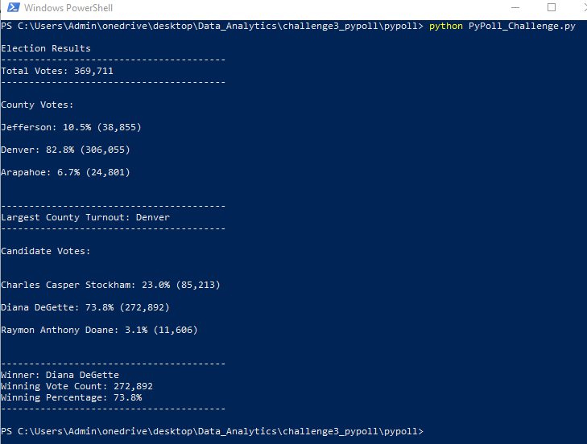

# PyPoll Election Analysis

## Project Overview
Complete an election audit for a recent congressional election and provide the following deliverables.

1. Calculate the total number of votes
2. Get a complete list of Counties that voted
3. Calculate the number of voters by County and their percentages
4. Identify the County with the largest turnout
5. Get a complete list of candidates that received votes
6. Calculate the number of votes each candidate received
7. Calculate the percentage of votes each candidate won
8. Determine election winner

## Resources
- Data Source: election_results.csv
- Software: Python 3.8.5, Visual Studio Code 1.56.2

## Summary
The resultant analysis of the election is as follows:
- 369,711 total votes were cast in the election
- The Counties that participated:
  - Jefferson with 10.5% of the votes and 38,855 total voters
  - Denver with 82.8% of the votes and 306,055 total voters
  - Arapahoe with 6.7% of the votes and 24,801 total voters
- Largest Turnout was Denver
- The candidates in the election were:
  - Charles Casper Stockham
  - Diana DeGette
  - Raymon Anthony Doane
- The candidate results were:
  - Charles Casper Stockham received 23.0% of the vote and 85,213 total votes
  - Diana DeGette received 73.8% of the vote and 272,892 total votes
  - Raymon Anthony Doane received 3.1% of the vote and 11,606 total votes
- The winner of the election was:
  - Diana DeGette who received 73.8% of the vote and 272,892 number of votes

## Election Overview

As can be seen by the above election results this program was able to provide the election analysis and produce the required deliverables. The printable election results are located in the "analysis" folder and named "election_analysis.txt". As we can see from the screen capture below, duplicate results are also printed to the terminal window for quick review once processed.

## Election Summary

Once we can determine the input data source is secure from tampering, reliable and verifiable the script does a great job at processing the results. The outputs are repeatable and can be trusted to produce the same results next year or in other elections. We are very much able to account for every single ballot ID and cross check the data by counties and by candidates, achieving the same totals.

Further, we can adjust the script to get more specific results. For example we can drill down one level more, for each candidate we can determine the vote distribution by county. Conversely, we can can also perform county vote distribution reporting by candidate. Both of these additions can give us a closer look at the voting patterns of counties. I believe the script improves the security of our election infrastructure and gives us verifiable results now and in the future.
